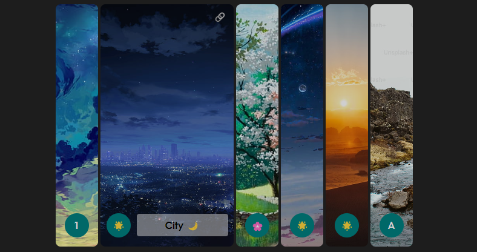

# Expandable Card

Simple Expandable Card



## Installation

- npm install expand-card-flavored
- npm i expand-card-flavored

## Global Registration

```javascript
import { createApp } from 'vue'
import App from './App.vue'
import ExpandCard from "expand-card-flavored"
import "expand-card-flavored/dist/style.css"

const app = createApp(App);

app.use(ExpandCard);

app.mount("#app");
```

## Local Registration

```javascript
import ExpandCard from 'expand-card-flavored'
import "expand-card-flavored/dist/style.css"

export default {
  name: 'App',
  components: {
    "expand-card": ExpandCard
  }
}
```

## Demo

```html
<template>
  <expand-card :cards="[
    {
      image_path: 'https:.....', 
      icon: null,
      label: 'Test',
    },
    {
      image_path: '@/assets/images/4.jpg',
      icon: 'A',
      label: 'Test'
    },
  ]
    " />
</template>
```
OR
```html
<template>
  <expand-card :cards="data" />
</template>

<script setup>
    var data = [
    {
      image_path: 'https:.....', 
      icon: null,
      label: 'Test',
    },
    {
      image_path: '@/assets/images/4.jpg',
      icon: 'A',
      label: 'Test'
    },
  ];
</script>
```

code for fun